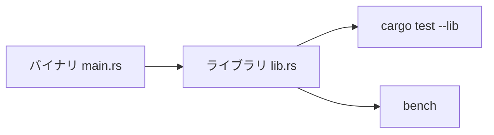
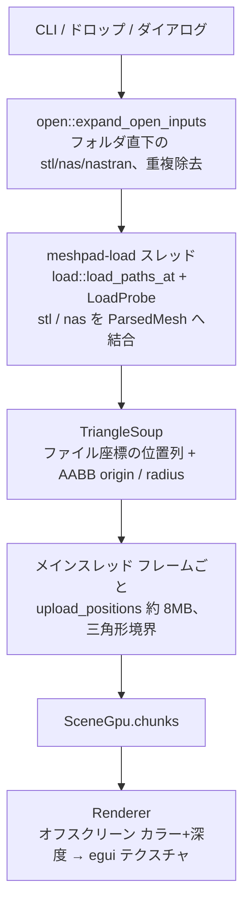
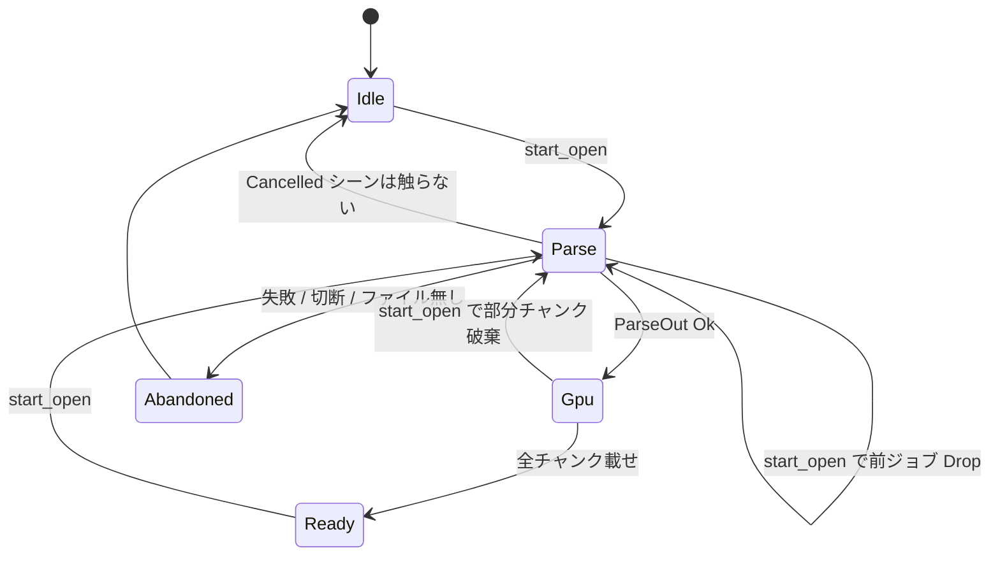
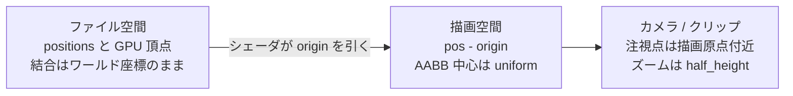
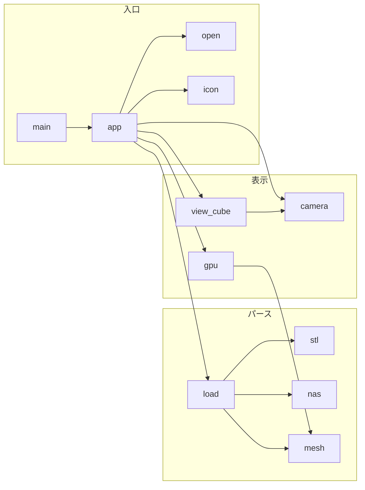
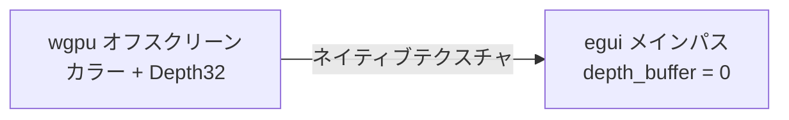

# 全体設計（開発者向け）

製品の約束（表示契約、1.0 の範囲、後段の C-lite）は [`project.md`](project.md)。
ここは **いまのコードがどう繋がるか** と、変更時にどこを触るか。

## クレートの切り方

| ターゲット | 入口          | 役割                                                                             |
| ---------- | ------------- | -------------------------------------------------------------------------------- |
| バイナリ   | `src/main.rs` | DX12、ウィンドウ、アダプタ上限。UI は持たない                                    |
| ライブラリ | `src/lib.rs`  | パース・カメラ・GPU・ウィンドウ。`cargo test --lib` と `bench/*.rs` がここを呼ぶ |

Windows 専用。wgpu バックエンドは DX12 固定。CRT は `.cargo/config.toml` で静的リンクする。

## 経路

開く操作は常に **新しいシーン**。読み込み中は前シーンの上にオーバーレイし、操作は止める。成功するまで `scene` は残す。

`ParseJob` の `Drop` が `LoadProbe::cancel` する。`ParseOut::Cancelled` ではシーンを触らない（後から成功した open を消さない）。`abandon_open` だけが `scene = None`。`start_open` は先に `opening = None` して前ジョブを捨てる。GPU 載せの途中でも同じで、部分チャンクは破棄され、前の成功シーンは残る。

## 座標

3 つの空間がある。混ぜない。

法線は頂点に持たない。フラグメントで `dpdx`/`dpdy` から面法線を出し、ヘッドライトを両面に当てる。

STL の 50 バイトレコードは GPU に直接載せない（末尾 2 バイト属性）。展開コピーする。

## モジュール

| ファイル    | 責務                                                              |
| ----------- | ----------------------------------------------------------------- |
| `open`      | 入口のパス列をシーン用ファイルへ。種類判定だけ。中身は読まない    |
| `load`      | STL と NAS を一つのスープに。進捗・キャンセル                     |
| `stl`       | mmap、バイナリ/ASCII、大きいバイナリは Rayon                      |
| `nas`       | bulk カード、`cp=0`、体積は外皮。点群先行はしない                 |
| `mesh`      | `TriangleSoup` / `ParsedMesh` / `LoadProbe`                       |
| `gpu`       | チャンク、オフスクリーン、アップロード予算。`proxy` は 1.0 では空 |
| `camera`    | 直交トラックボール、Y-up、フィット、tween                         |
| `view_cube` | egui 2D。スナップ方向はビュー行列の線形部分                       |
| `app`       | タイトルバー、開く状態機械、入力、オーバーレイ                    |
| `icon`      | ICO 内 PNG                                                        |

後段の LOD を足すなら `SceneGpu::proxy` とチャンク差し替えが接点。パースとカメラは触らなくてよい想定。

## GPU と UI

egui のメインパスに深度が無い。`main` は `depth_buffer: 0`。メッシュは `Renderer` がオフスクリーンに描き、`Image` で載せる。

eframe 既定の `max_buffer_size` は 256MB で lucy 級が載らない。`main` がアダプタ上限を要求し、`gpu::verts_per_chunk` が三角形境界で分割する。1 フレームの載せ量は `UPLOAD_FRAME_BYTES`（8MB）。

## カメラの注意

- 軌道は画面の right/up。世界軸はドラッグ中ロックしない
- `Y` は `y_up` を切り、視線を保って world up を画面上へ。視線が world up と平行ならポール退避（Y なら Z）
- `Y` 切替の tween を軌道・パン・ズームで切るときは `apply_world_up` してから捨てる（フラグと姿勢を一致させる）
- ビューキューブの上向きは「いま上の面」であり、`y_up` とは別

## 変更の目安

| やりたいこと                     | 触る場所              |
| -------------------------------- | --------------------- |
| 拡張子・フォルダ規則             | `open.rs`             |
| STL レコード / ASCII             | `stl.rs`              |
| Nastran カード・外皮             | `nas.rs`              |
| 複数ファイルの結合順             | `load.rs`             |
| バッファ分割・1 フレームの載せ量 | `gpu.rs`              |
| シェーダ・ライティング           | `mesh.wgsl`           |
| マウス・フィット・Y-up           | `camera.rs`, `app.rs` |
| ウィンドウ枠・ステータス         | `app.rs`              |
| DX12・バッファ上限               | `main.rs`             |

## テストと計測

- ユニット: `cargo test --lib`（GPU デバイスは作らない）
- パース壁時計: `cargo bench --bench stl_parse` / `nas_parse`。手順は `bench/README.md`
- CI: `.github/workflows/ci.yml`（Windows、fmt / clippy / lib テスト）
- 配布: タグ `v*.*.*` が `Cargo.toml` の version と一致すること。Release workflow が `meshpad.exe` を載せる
